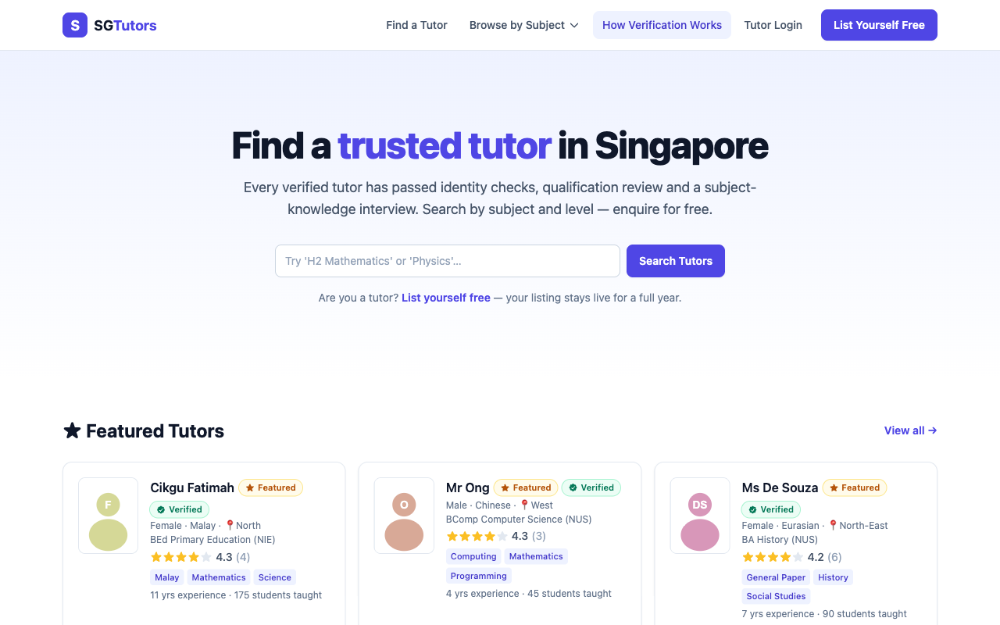

# SG Tutors — Singapore Tutors Marketplace


A full-stack tutor marketplace for Singapore. Tutors list themselves free for one
year, get **verified** through document checks plus a **10-minute AI interview**
(scored by Claude), and can pay to be **featured**. Parents and students search by
subject, level, gender and location, read reviews, and enquire directly — protected
by invisible Cloudflare Turnstile.



## Features

### For students & parents
- Search tutors by **subject, level, gender, location** and keyword — featured and verified tutors rank first
- Tutor profiles with passport-style photo, qualifications, experience, star ratings and reviews
- **Privacy by design**: NRIC, date of birth, address, mobile and email are never exposed — only a coarse region (North, North-West, …) is shown
- Enquiry form (emails the tutor + admin) guarded by **invisible Cloudflare Turnstile**
- Social sharing (WhatsApp, Telegram, Facebook, X) on every tutor profile

### For tutors
- Free 1-year listing with one-click renewal; camera-captured passport photo with **automatic AI background removal** (client-side WASM)
- **Verification (S$50, Stripe card/PayNow)** → upload NRIC + qualification cert (+ optional CV) → timed **AI interview**: 8 progressively harder, syllabus-grounded questions in 10 minutes, pass mark 70/100
- Appeal flow with admin-scheduled **live interview** for failed candidates
- **Featured placement (S$100 / 3 months)** for verified tutors — top of search + homepage
- LinkedIn profile link (displayed only while verified)
- Login with password or **email OTP**; forgot-password reset flow

### Admin dashboard
- **Overview analytics**: total & monthly revenue chart, popular tutors ranked by enquiries, verified/featured lists
- Tutor management with full records, private document viewer, AI interview transcripts (with anti-cheat paste flags), verify/reject actions
- Appeals queue with live-interview scheduling, enquiry log, review moderation

## Architecture

```
sgtutors/
├── client/                 # React 18 + Vite + TypeScript + Tailwind (white theme, mobile-first)
│   └── src/
│       ├── pages/          # Home, TutorSearch, TutorDetail, Signup, Login, Dashboard,
│       │                   # Interview (AI chat), Admin, AdminLogin
│       ├── components/     # Navbar (subject mega-menu), TutorCard, CameraCapture,
│       │                   # Turnstile (invisible), ShareButtons, badges…
│       └── lib/            # photoPipeline (capture → bg-removal → white bg → 35:45 crop)
├── server/                 # Express + TypeScript + Drizzle ORM
│   └── src/
│       ├── db/             # schema, seed (subjects/levels/admin), mockTutors
│       ├── routes/         # public API, tutor auth (+OTP), tutor, admin, Stripe webhook
│       └── services/       # sanitize (PII whitelist), interview (Claude Agent SDK),
│                           # stripe, storage (Cloudflare R2), gdrive, retention, otp,
│                           # email, turnstile
├── shared/                 # Types, enums and zod validation shared by both sides
└── docker-compose.yml      # PostgreSQL 16 (host port 5433)
```

**Storage policy — no files on the server.** Profile photos are stored in
**Cloudflare R2**; verification documents are archived to a per-tutor **Google
Drive** subfolder (admin supplies the parent folder ID) and **erased 3 months
after verification** by a daily retention sweep. Local disk is used only as a
development fallback when credentials are absent.

**AI interview.** The server drives the [Claude Agent SDK](https://docs.claude.com/en/api/agent-sdk/overview)
with stateless per-turn queries authenticated by a Claude subscription token
(`claude setup-token`) or an Anthropic API key. The 10-minute timer is enforced
server-side; transcripts and per-question marking are stored for admin review.

## Getting started

Prerequisites: Node 20+, Docker (for PostgreSQL).

```bash
npm install
cp .env.example .env          # fill in keys as needed (see below)
npm run db:up                 # PostgreSQL 16 on port 5433
npm run db:push               # create schema
npm run db:seed               # subjects, levels, admin account
npm run dev                   # client http://localhost:5173 · API http://localhost:4000
```

Optional demo data (30 tutors: 10 featured, 10 verified, 10 unverified):

```bash
cd server && npx tsx src/db/mockTutors.ts
```

Demo logins: tutors `mock.tutor1..30@sgtutors.local` / `mocktutor123`,
admin `admin@sgtutors.local` / `admin123` at `/admin/login`.

### Environment

All settings live in `.env` (see `.env.example` for full notes):

| Group | Keys | Purpose |
|---|---|---|
| Stripe | `STRIPE_SECRET_KEY`, `STRIPE_WEBHOOK_SECRET` | S$50 verification & S$100 featured checkout (card + PayNow) |
| Turnstile | `TURNSTILE_SECRET_KEY`, `VITE_TURNSTILE_SITE_KEY` | Invisible captcha on enquiries (test keys included) |
| Claude | `CLAUDE_CODE_OAUTH_TOKEN` or `ANTHROPIC_API_KEY` | AI interview engine |
| Cloudflare R2 | `R2_ACCOUNT_ID`, `R2_ACCESS_KEY_ID`, `R2_SECRET_ACCESS_KEY`, `R2_BUCKET`, `R2_PUBLIC_BASE_URL` | Profile photo storage |
| Google Drive | `GDRIVE_PARENT_FOLDER_ID`, `GDRIVE_SERVICE_ACCOUNT_JSON` | Verification document archive |
| Email | `SMTP_*`, `EMAIL_DEV_MODE` | Enquiry/OTP/status emails (dev mode logs to console) |

Stripe webhooks in development: `npm run stripe:listen`.

## Verification flow

```
Pay S$50 (Stripe) ──▶ Upload NRIC + cert (+CV) ──▶ 10-min AI interview (8 Qs)
                                                        │
                              score ≥ 70 ──▶ ✅ Verified badge
                              score < 70 ──▶ Appeal ──▶ Live interview ──▶ Admin decision
```

## Roadmap

- Native iOS and Android apps consuming the same REST API

## Acknowledgements

- [Claude Agent SDK](https://docs.claude.com/en/api/agent-sdk/overview) — AI interviewer & scorer
- [@imgly/background-removal](https://github.com/imgly/background-removal-js) — in-browser passport photo background removal
- [Cloudflare Turnstile](https://developers.cloudflare.com/turnstile/) & [R2](https://developers.cloudflare.com/r2/)
- [Stripe](https://stripe.com) — payments with PayNow support

---

Powered by [Tertiary Infotech Academy Pte Ltd](https://www.tertiaryinfotech.com/)
